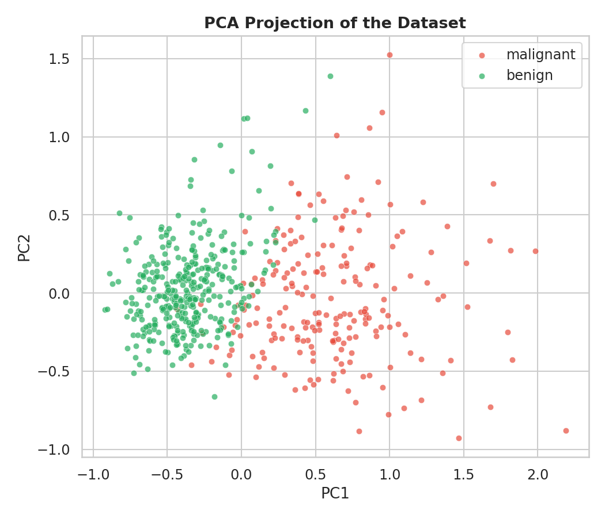
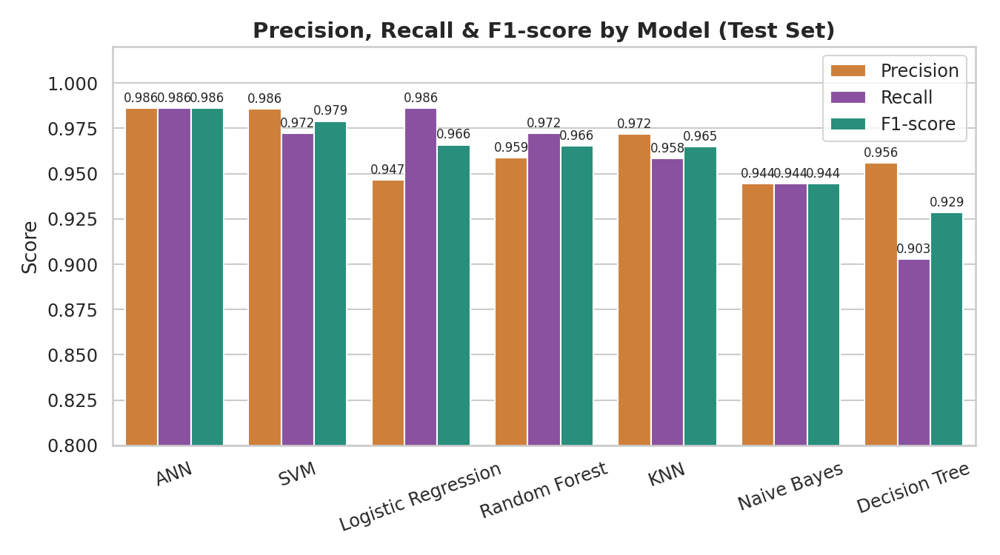
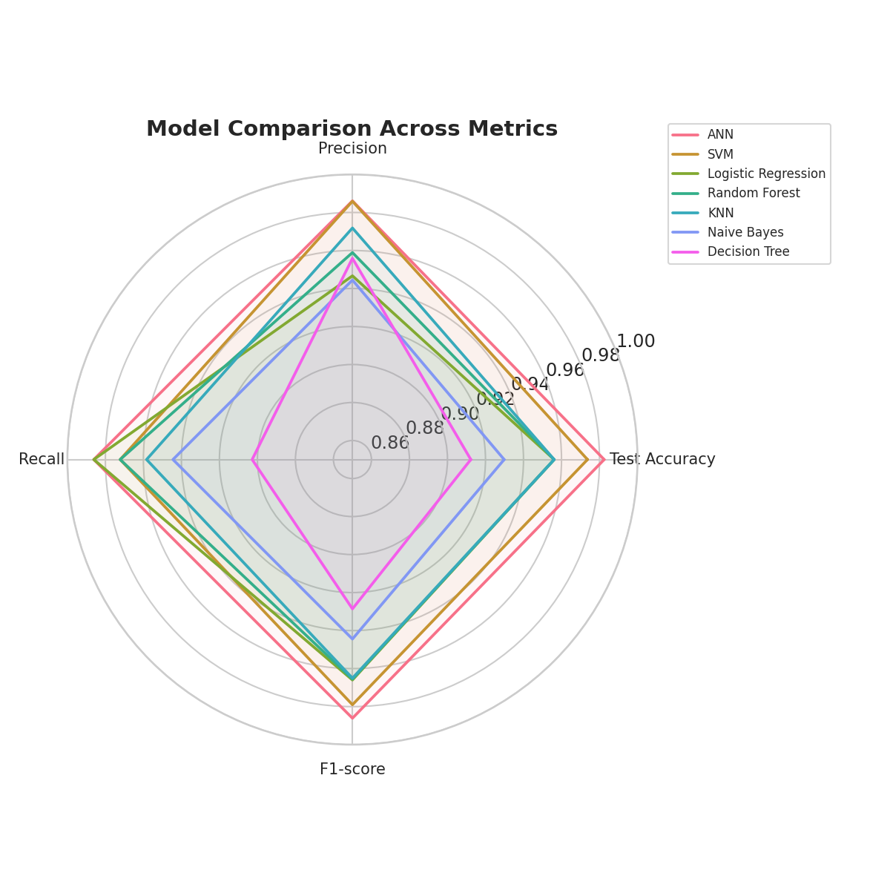
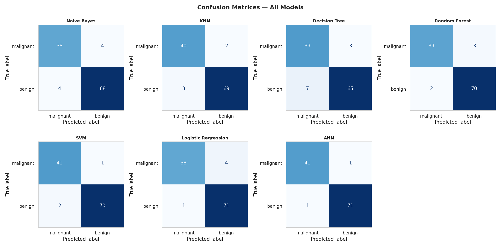
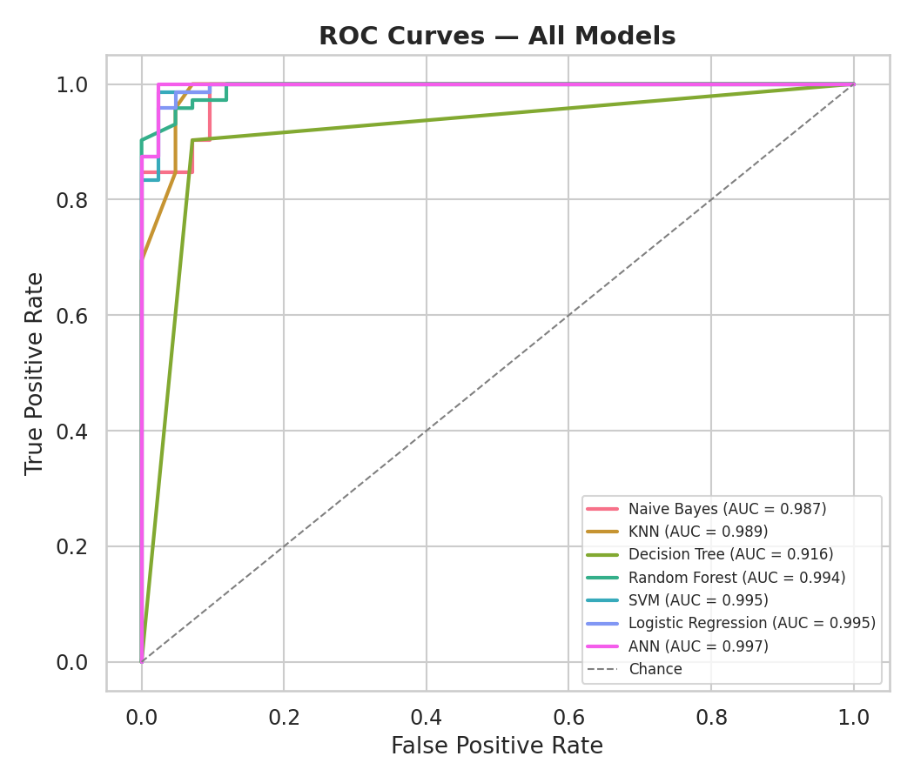
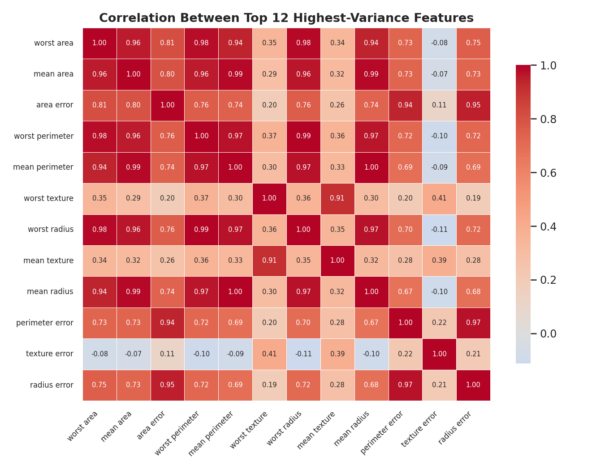

# Breast Cancer Classification Comparison

A comparative study of seven classic machine learning algorithms for breast cancer diagnosis on the Wisconsin Breast Cancer dataset — going beyond a single accuracy score to look at precision/recall trade-offs, cross-validated stability, ROC-AUC, and feature importance.



## Overview

This project trains and evaluates seven classifiers on an identical, leakage-free preprocessing pipeline, then compares them side by side:

- Gaussian Naive Bayes
- k-Nearest Neighbors (kNN)
- Decision Tree
- Random Forest
- Support Vector Machine (SVM)
- Logistic Regression
- Artificial Neural Network (MLP)

In a diagnostic setting, missing a malignant case (low recall) is far more costly than a false alarm — so the comparison looks at precision and recall separately, not just overall accuracy.

## Dataset

The [Breast Cancer Wisconsin (Diagnostic) dataset](https://scikit-learn.org/stable/datasets/toy_dataset.html#breast-cancer-dataset), loaded directly via `sklearn.datasets.load_breast_cancer()`:

- 569 samples, 30 numeric features (radius, texture, perimeter, area, smoothness, etc., computed from digitized images of fine needle aspirates)
- Binary target: malignant / benign

As the PCA projection above shows, the two classes separate fairly cleanly even in just two principal components — a good early signal that most classifiers should perform well here.

## Pipeline

1. **Explore** the dataset: class balance, and correlation between the highest-variance features.
2. **Split** into train (80%) / test (20%) with `train_test_split`, using a fixed `random_state` and `stratify` to keep results reproducible and class-balanced.
3. **Scale** features with `MinMaxScaler`, fit only on the training set and applied to the test set — no data leakage.
4. **Train** all seven classifiers on the same scaled training data.
5. **Evaluate** each model on training accuracy, test accuracy, precision, recall, and F1-score.
6. **Validate** more rigorously with 5-fold stratified cross-validation, so results aren't dependent on one lucky/unlucky split.
7. **Visualize** everything: metric comparisons, a radar chart, confusion matrices, ROC curves, feature importance, and learning curves.

## Results

| Model               | Train Acc. | Test Acc. | Precision | Recall | F1-score |
| ------------------- | ---------- | --------- | --------- | ------ | -------- |
| ANN                 | 0.989      | 0.983     | 0.986     | 0.986  | 0.986    |
| SVM                 | 0.987      | 0.974     | 0.986     | 0.972  | 0.979    |
| Logistic Regression | 0.978      | 0.956     | 0.947     | 0.986  | 0.966    |
| Random Forest       | 1.000      | 0.956     | 0.959     | 0.972  | 0.966    |
| KNN                 | 0.980      | 0.956     | 0.972     | 0.958  | 0.965    |
| Naive Bayes         | 0.939      | 0.930     | 0.944     | 0.944  | 0.944    |
| Decision Tree       | 1.000      | 0.912     | 0.956     | 0.903  | 0.929    |

_(Single 80/20 split, `random_state=42`. See the cross-validation section below for a more robust comparison.)_

### Precision, Recall & F1-score



### Multi-metric snapshot



### Confusion matrices



### ROC curves



### Feature correlation



Random Forest and Decision Tree perfectly fit the training data (1.000), which is a classic overfitting signature — their lower test scores compared to ANN and SVM reflect that. ANN and SVM generalize the best on this split, though the cross-validation results in the notebook show all models are fairly close and stable overall.

## Requirements

```
numpy
pandas
scikit-learn
matplotlib
seaborn
```

Install with:

```bash
pip install numpy pandas scikit-learn matplotlib seaborn
```

## Usage

```bash
git clone https://github.com/sadrayef/breast-cancer-classification-comparison.git
cd breast-cancer-classification-comparison
jupyter notebook Breast_cancer.ipynb
```

Run all cells in order. The train/test split and all stochastic models use a fixed `random_state`, so results are reproducible across runs.

## Notes & Possible Extensions

- Hyperparameters are set manually rather than tuned via `GridSearchCV` or `RandomizedSearchCV`.
- The dataset is fairly small and clean; results might shift with a noisier, real-world clinical dataset.
- Model explainability (e.g. SHAP values) would be a natural next step beyond basic feature importance.

## Disclaimer

This project is for educational and research purposes as part of a machine learning coursework assignment. It is **not** intended for clinical or diagnostic use.

## License

This project is open source and available under the [MIT License](LICENSE).
